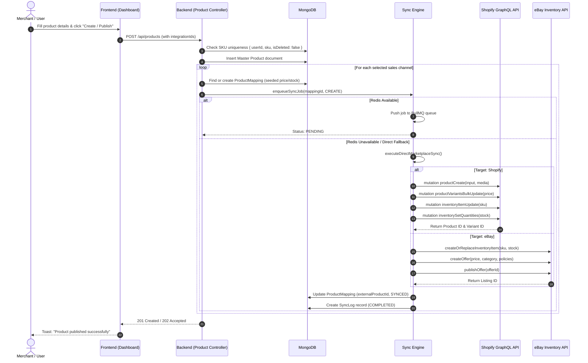
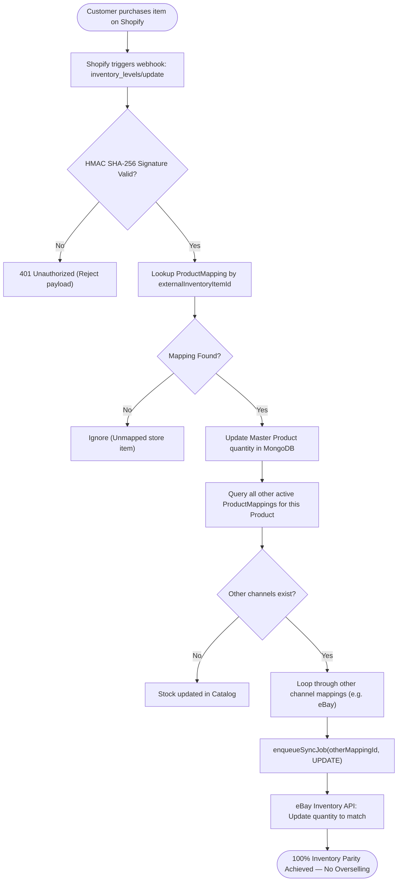
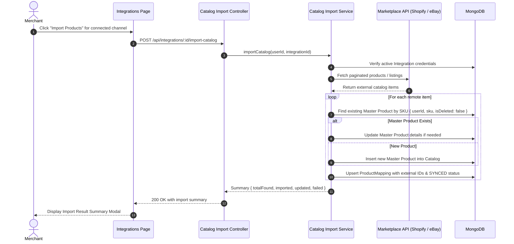
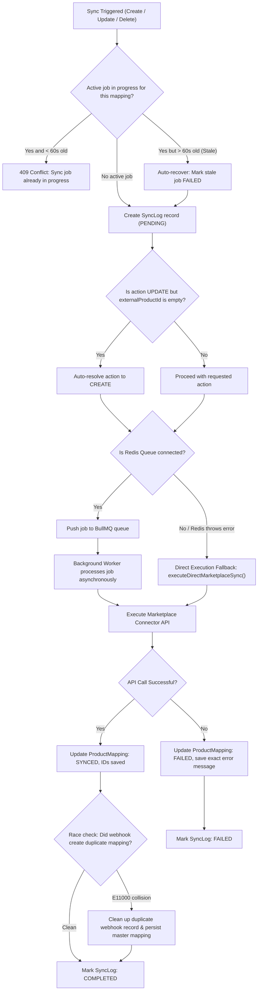
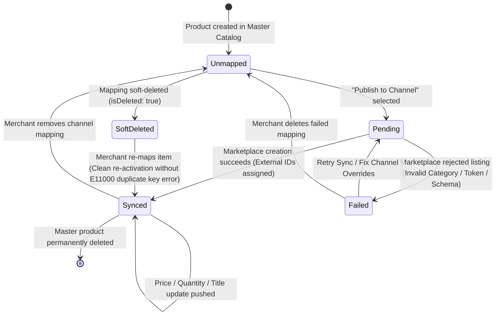

# MultiChannel Commerce — System Architecture & Flow Diagrams

This document contains comprehensive architecture and workflow diagrams for the MultiChannel Commerce application. All diagrams are written in standard [Mermaid](https://mermaid.js.org/) syntax and can be previewed directly on GitHub or pasted into [mermaid.live](https://mermaid.live).

---

## Table of Contents
1. [High-Level System Architecture](#1-high-level-system-architecture)
2. [Product Creation & Marketplace Publishing Flow](#2-product-creation--marketplace-publishing-flow)
3. [Shopify Real-Time Webhook & Cross-Channel Inventory Sync](#3-shopify-real-time-webhook--cross-channel-inventory-sync)
4. [Catalog Import Flow (Shopify & eBay to Master Catalog)](#4-catalog-import-flow-shopify--ebay-to-master-catalog)
5. [Resilient Sync & Redis Queue Fallback Architecture](#5-resilient-sync--redis-queue-fallback-architecture)
6. [Product Mapping Lifecycle & Soft-Delete Re-Activation](#6-product-mapping-lifecycle--soft-delete-re-activation)

---

## 1. Complete System Architecture & Flow Diagram

> [!TIP]
> **Interactive Browser Viewer:** Open [`system-flow-diagram.html`](file:///c:/Users/acer/Desktop/AmazingInk/multichannel-commerce/system-flow-diagram.html) or `http://localhost:3000/system-flow.html` to view, zoom, and pan across this complete architecture diagram.

```mermaid
flowchart TB
    %% ===================================================
    %% 1. FRONTEND LAYER (PINK CONTAINER)
    %% ===================================================
    subgraph Frontend["Frontend Layer (Next.js 15 App Router)"]
        direction TB

        subgraph FE_Inputs["UI Views and Form Components"]
            direction LR
            FE_Cache["TanStack Query Cache<br/>and Auto-Refetch"]
            FE_Forms["Product and Integration Forms<br/>and Publish Modals"]
            FE_Dash["Web Dashboard UI<br/>and Analytics Tables"]
        end

        FE_Client["Frontend API Client (Services)<br/>(Unified Axios / Fetch Client)"]

        FE_Cache --> FE_Client
        FE_Forms --> FE_Client
        FE_Dash --> FE_Client
    end

    %% ===================================================
    %% 2. BACKEND LAYER (TEAL CONTAINER)
    %% ===================================================
    subgraph Backend["Backend Layer (Node.js / Express / TypeScript)"]
        direction TB

        BE_Auth["JWT Authentication and Middleware<br/>(Bearer Token Scoping and Zod Schemas)"]
        BE_WebhookCtrl["Webhook Controller and Verifier<br/>(HMAC-SHA256 and Race De-duplication)"]

        subgraph BE_Services["Core Application Services"]
            direction LR
            BE_ProdSvc["Product Management Service<br/>(Master Catalog and Scoped SKU)"]
            BE_MapSvc["Product Mapping Service<br/>(Price/Stock Overrides and Parity)"]
            BE_OAuthSvc["OAuth and Integrations Service<br/>(Shopify Tokens and eBay Refresh)"]
            BE_ImportSvc["CSV and Catalog Import Service<br/>(Bulk Stream Upsert Engine)"]
            BE_Sync["Sync Engine and Connectors<br/>(Idempotency and Direct Fallback)"]
        end

        BE_Auth -- "Authorized Request" --> BE_ProdSvc
        BE_Auth --> BE_MapSvc
        BE_Auth --> BE_OAuthSvc
        BE_Auth --> BE_ImportSvc
        BE_Auth --> BE_Sync

        BE_WebhookCtrl -- "Inventory Parity" --> BE_ProdSvc
        BE_WebhookCtrl -- "Fan-Out Parity" --> BE_MapSvc
        BE_WebhookCtrl -- "Sync Event" --> BE_Sync

        BE_ProdSvc -- "Trigger Publish" --> BE_MapSvc
        BE_MapSvc -- "Dispatch Sync Job" --> BE_Sync
    end

    %% ===================================================
    %% 3. EXTERNAL SALES CHANNELS (CYAN CONTAINER)
    %% ===================================================
    subgraph Channels["External Sales Channels"]
        direction TB
        CH_Ebay["eBay Marketplace<br/>(REST and Inventory API, Offers, Taxonomy)"]
        CH_Custom["Custom Website Channel<br/>(Direct REST Storefront and Webhooks)"]
        CH_Shopify["Shopify Store<br/>(GraphQL Admin API 2026 and Webhooks)"]
    end

    %% ===================================================
    %% 4. DATA & JOB INFRASTRUCTURE (ORANGE CONTAINER)
    %% ===================================================
    subgraph Infra["Data and Job Infrastructure"]
        direction TB
        INF_Queue[("Redis + BullMQ Queue<br/>(product-sync-queue and Retries)")]
        INF_Worker["BullMQ Worker Daemon<br/>(Concurrency: 5 / Background)"]
        INF_Mongo[("MongoDB Atlas Database<br/>(Products, Mappings, Integrations, Logs)")]

        INF_Queue --> INF_Worker
    end

    %% Keep bottom two subgraphs side-by-side
    Channels ~~~ Infra

    %% ===================================================
    %% CROSS-TIER DATA FLOW CONNECTIONS
    %% ===================================================

    %% Frontend to Backend
    FE_Client -- "REST HTTP / JSON" --> BE_Auth

    %% Backend to External Channels
    BE_Sync -- "Inventory API and Offers" --> CH_Ebay
    BE_Sync -- "Direct API" --> CH_Custom
    BE_Sync -- "GraphQL Mutations" --> CH_Shopify
    BE_OAuthSvc -- "OAuth 2.0 Auth and Refresh" --> CH_Shopify
    BE_OAuthSvc -- "OAuth 2.0 Auth and Policies" --> CH_Ebay

    %% Inbound Webhook: Shopify back to Backend
    CH_Shopify -- "HTTP Webhook (HMAC-SHA256)" --> BE_WebhookCtrl

    %% Backend to Data Infrastructure
    BE_Sync -- "Enqueue Job" --> INF_Queue
    BE_Sync -- "Direct Sync Fallback" --> INF_Mongo
    BE_ProdSvc <--> INF_Mongo
    BE_MapSvc <--> INF_Mongo
    BE_OAuthSvc <--> INF_Mongo
    BE_ImportSvc <--> INF_Mongo

    %% Worker back to Sync Connectors
    INF_Worker -- "Worker Processing (Execute Job)" --> BE_Sync

    %% ===================================================
    %% VISUAL STYLES MATCHING THE REFERENCE IMAGE
    %% ===================================================
    style Frontend fill:#fae8f5,stroke:#ec4899,stroke-width:2px
    style Backend fill:#e6fffa,stroke:#10b981,stroke-width:2px
    style Channels fill:#e0f2fe,stroke:#0284c7,stroke-width:2px
    style Infra fill:#fef3c7,stroke:#f59e0b,stroke-width:2px

    style FE_Inputs fill:#ffffff,stroke:#f472b6,stroke-width:1px,stroke-dasharray: 3 3
    style BE_Services fill:#ffffff,stroke:#2dd4bf,stroke-width:1px,stroke-dasharray: 3 3

    classDef card fill:#ffffff,stroke:#1e293b,stroke-width:1.5px,rx:6px,ry:6px,color:#0f172a,font-size:13px;
    classDef cylinder fill:#ffffff,stroke:#1e293b,stroke-width:1.5px,color:#0f172a,font-size:13px;

    class FE_Cache,FE_Forms,FE_Dash,FE_Client card;
    class BE_WebhookCtrl,BE_Auth,BE_Sync,BE_ProdSvc,BE_MapSvc,BE_OAuthSvc,BE_ImportSvc card;
    class CH_Ebay,CH_Custom,CH_Shopify card;
    class INF_Worker card;
    class INF_Queue,INF_Mongo cylinder;
```

---

## 2. Product Creation & Marketplace Publishing Flow

---

## 3. Shopify Real-Time Webhook & Cross-Channel Inventory Sync

This flow prevents **multi-channel overselling**. When an order is placed on Shopify, the stock level decreases, triggering an automatic fan-out sync to eBay and other channels.

---

## 4. Catalog Import Flow (Shopify & eBay to Master Catalog)

---

## 5. Resilient Sync & Redis Queue Fallback Architecture

---

## 6. Product Mapping Lifecycle & Soft-Delete Re-Activation

