# Complete MultiChannel Commerce System Flow Diagram

This document contains the **Complete System Flow & Architecture Diagram** for the MultiChannel Commerce application, mirroring and completing the exact layout from the architecture design diagram (Frontend Layer, Backend Layer, External Sales Channels, and Data & Job Infrastructure).

> [!TIP]
> **Interactive Browser Viewer Available:**
> You can open [`system-flow-diagram.html`](file:///c:/Users/acer/Desktop/AmazingInk/multichannel-commerce/system-flow-diagram.html) directly in any browser (or at `http://localhost:3000/system-flow.html`) for interactive pan & zoom, subsystem filtering, and one-click export!

---

## 1. Complete System Architecture Diagram (Matching Reference Layout)

Copy and paste the code below directly into **[mermaid.live](https://mermaid.live)** or view it in any markdown previewer:

```mermaid
flowchart TB
    %% ===================================================
    %% 1. FRONTEND LAYER (PINK CONTAINER)
    %% ===================================================
    subgraph Frontend["Frontend Layer (Next.js 15 App Router)"]
        direction TB

        subgraph FE_Inputs["UI Views and Form Components"]
            direction LR
            FE_Cache["TanStack Query Cache<br/>and Auto-Refetch"]
            FE_Forms["Product and Integration Forms<br/>and Publish Modals"]
            FE_Dash["Web Dashboard UI<br/>and Analytics Tables"]
        end

        FE_Client["Frontend API Client (Services)<br/>(Unified Axios / Fetch Client)"]

        FE_Cache --> FE_Client
        FE_Forms --> FE_Client
        FE_Dash --> FE_Client
    end

    %% ===================================================
    %% 2. BACKEND LAYER (TEAL CONTAINER)
    %% ===================================================
    subgraph Backend["Backend Layer (Node.js / Express / TypeScript)"]
        direction TB

        BE_Auth["JWT Authentication and Middleware<br/>(Bearer Token Scoping and Zod Schemas)"]
        BE_WebhookCtrl["Webhook Controller and Verifier<br/>(HMAC-SHA256 and Race De-duplication)"]

        subgraph BE_Services["Core Application Services"]
            direction LR
            BE_ProdSvc["Product Management Service<br/>(Master Catalog and Scoped SKU)"]
            BE_MapSvc["Product Mapping Service<br/>(Price/Stock Overrides and Parity)"]
            BE_OAuthSvc["OAuth and Integrations Service<br/>(Shopify Tokens and eBay Refresh)"]
            BE_ImportSvc["CSV and Catalog Import Service<br/>(Bulk Stream Upsert Engine)"]
            BE_Sync["Sync Engine and Connectors<br/>(Idempotency and Direct Fallback)"]
        end

        BE_Auth -- "Authorized Request" --> BE_ProdSvc
        BE_Auth --> BE_MapSvc
        BE_Auth --> BE_OAuthSvc
        BE_Auth --> BE_ImportSvc
        BE_Auth --> BE_Sync

        BE_WebhookCtrl -- "Inventory Parity" --> BE_ProdSvc
        BE_WebhookCtrl -- "Fan-Out Parity" --> BE_MapSvc
        BE_WebhookCtrl -- "Sync Event" --> BE_Sync

        BE_ProdSvc -- "Trigger Publish" --> BE_MapSvc
        BE_MapSvc -- "Dispatch Sync Job" --> BE_Sync
    end

    %% ===================================================
    %% 3. EXTERNAL SALES CHANNELS (CYAN CONTAINER)
    %% ===================================================
    subgraph Channels["External Sales Channels"]
        direction TB
        CH_Ebay["eBay Marketplace<br/>(REST and Inventory API, Offers, Taxonomy)"]
        CH_Custom["Custom Website Channel<br/>(Direct REST Storefront and Webhooks)"]
        CH_Shopify["Shopify Store<br/>(GraphQL Admin API 2026 and Webhooks)"]
    end

    %% ===================================================
    %% 4. DATA & JOB INFRASTRUCTURE (ORANGE CONTAINER)
    %% ===================================================
    subgraph Infra["Data and Job Infrastructure"]
        direction TB
        INF_Queue[("Redis + BullMQ Queue<br/>(product-sync-queue and Retries)")]
        INF_Worker["BullMQ Worker Daemon<br/>(Concurrency: 5 / Background)"]
        INF_Mongo[("MongoDB Atlas Database<br/>(Products, Mappings, Integrations, Logs)")]

        INF_Queue --> INF_Worker
    end

    %% Keep bottom two subgraphs side-by-side
    Channels ~~~ Infra

    %% ===================================================
    %% CROSS-TIER DATA FLOW CONNECTIONS
    %% ===================================================

    %% Frontend to Backend
    FE_Client -- "REST HTTP / JSON" --> BE_Auth

    %% Backend to External Channels
    BE_Sync -- "Inventory API and Offers" --> CH_Ebay
    BE_Sync -- "Direct API" --> CH_Custom
    BE_Sync -- "GraphQL Mutations" --> CH_Shopify
    BE_OAuthSvc -- "OAuth 2.0 Auth and Refresh" --> CH_Shopify
    BE_OAuthSvc -- "OAuth 2.0 Auth and Policies" --> CH_Ebay

    %% Inbound Webhook: Shopify back to Backend
    CH_Shopify -- "HTTP Webhook (HMAC-SHA256)" --> BE_WebhookCtrl

    %% Backend to Data Infrastructure
    BE_Sync -- "Enqueue Job" --> INF_Queue
    BE_Sync -- "Direct Sync Fallback" --> INF_Mongo
    BE_ProdSvc <--> INF_Mongo
    BE_MapSvc <--> INF_Mongo
    BE_OAuthSvc <--> INF_Mongo
    BE_ImportSvc <--> INF_Mongo

    %% Worker back to Sync Connectors
    INF_Worker -- "Worker Processing (Execute Job)" --> BE_Sync

    %% ===================================================
    %% VISUAL STYLES MATCHING THE REFERENCE IMAGE
    %% ===================================================
    style Frontend fill:#fae8f5,stroke:#ec4899,stroke-width:2px
    style Backend fill:#e6fffa,stroke:#10b981,stroke-width:2px
    style Channels fill:#e0f2fe,stroke:#0284c7,stroke-width:2px
    style Infra fill:#fef3c7,stroke:#f59e0b,stroke-width:2px

    style FE_Inputs fill:#ffffff,stroke:#f472b6,stroke-width:1px,stroke-dasharray: 3 3
    style BE_Services fill:#ffffff,stroke:#2dd4bf,stroke-width:1px,stroke-dasharray: 3 3

    classDef card fill:#ffffff,stroke:#1e293b,stroke-width:1.5px,rx:6px,ry:6px,color:#0f172a,font-size:13px;
    classDef cylinder fill:#ffffff,stroke:#1e293b,stroke-width:1.5px,color:#0f172a,font-size:13px;

    class FE_Cache,FE_Forms,FE_Dash,FE_Client card;
    class BE_WebhookCtrl,BE_Auth,BE_Sync,BE_ProdSvc,BE_MapSvc,BE_OAuthSvc,BE_ImportSvc card;
    class CH_Ebay,CH_Custom,CH_Shopify card;
    class INF_Worker card;
    class INF_Queue,INF_Mongo cylinder;
```

---

## 2. What Was Incomplete in the Draft & How It Is Completed

| Subsystem | What Was Incomplete in the Draft Image | How It Is Resolved & Completed |
| :--- | :--- | :--- |
| **Frontend Layer** | Only showed basic forms and dashboard; omitted cache refetching, publish modals, and mapping management. | Shows all UI inputs (`TanStack Query Cache`, `Forms & Modals`, `Dashboard & Analytics`) routing through the unified `Frontend API Client`. |
| **Backend Layer** | Missing OAuth token engine, catalog import services, and direct fallback execution; criss-crossing arrow logic. | Integrated `OAuth & Integrations Service` (Shopify & eBay token loop), `CSV & Catalog Importer`, and `Direct Sync Fallback Engine`. |
| **Worker Processing Loop** | In the draft, worker processing looped from Redis around the entire diagram into Webhook Controller. | `BullMQ Worker Daemon` correctly consumes jobs from `Redis + BullMQ Queue` and executes them via `Sync Engine & Connectors`. |
| **Webhooks & Parity** | Only a single generic line from Shopify into Webhook Controller. | Accurately models HMAC-SHA256 verification, race-condition de-duplication, and cross-channel inventory fan-out to eBay. |
| **Data Infrastructure** | Cylinders were connected without showing the direct fallback or model relationships. | Shows read/write access to `MongoDB Atlas` from all core services plus direct fallback when Redis is offline. |

---

## 3. End-to-End Workflow Summaries

### A. Product Publishing Flow
1. **User Action:** Merchant opens `Product Publish Modal` on Next.js frontend and selects channels (e.g., Shopify, eBay).
2. **API Call:** `Frontend API Client` issues `POST /api/products/:id/publish` with Bearer JWT.
3. **Validation & Mapping:** `JWT Authentication` validates user & tenant scoping; `Product Management Service` coordinates with `Product Mapping Service` to create or retrieve channel mappings.
4. **Queue & Fallback:** `Sync Engine` attempts to push a job into `Redis + BullMQ Queue`. If Redis is offline, it immediately executes via `Direct Sync Fallback`.
5. **Execution:** Connector invokes Shopify Admin GraphQL (`productCreate`, `productVariantsBulkUpdate`, `inventoryItemUpdate`, `inventorySetQuantities`) or eBay Inventory REST API (`createOrReplaceInventoryItem`, `createOffer`, `publishOffer`).
6. **State Persistence:** External IDs (`externalProductId`, `externalVariantId`, `externalInventoryItemId`) are persisted in MongoDB Atlas `productmappings` collection, and status is set to `SYNCED`.

### B. Inbound Webhook (Oversell Protection)
1. **Trigger:** A customer buys an item on Shopify or stock changes externally.
2. **Delivery:** Shopify sends `POST /api/integrations/shopify/webhooks` with an `X-Shopify-Hmac-Sha256` header.
3. **Verification:** `Webhook Controller & Verifier` verifies HMAC using the shop's client secret.
4. **Stock Update:** Master product inventory is updated in MongoDB Atlas.
5. **Parity Broadcast:** `Product Mapping Service` triggers a fan-out update to eBay and Custom Website to ensure stock counts match everywhere simultaneously, preventing overselling.

---

## 4. How to Use the Diagrams
- **In Browser:** Double-click [`system-flow-diagram.html`](file:///c:/Users/acer/Desktop/AmazingInk/multichannel-commerce/system-flow-diagram.html) or navigate to `http://localhost:3000/system-flow.html` to view the interactive diagram with pan & zoom.
- **In mermaid.live:** Copy the Mermaid code block from Section 1 and paste it at **[https://mermaid.live](https://mermaid.live)**.
